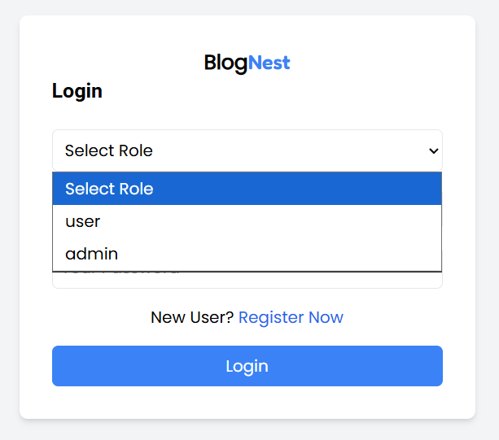
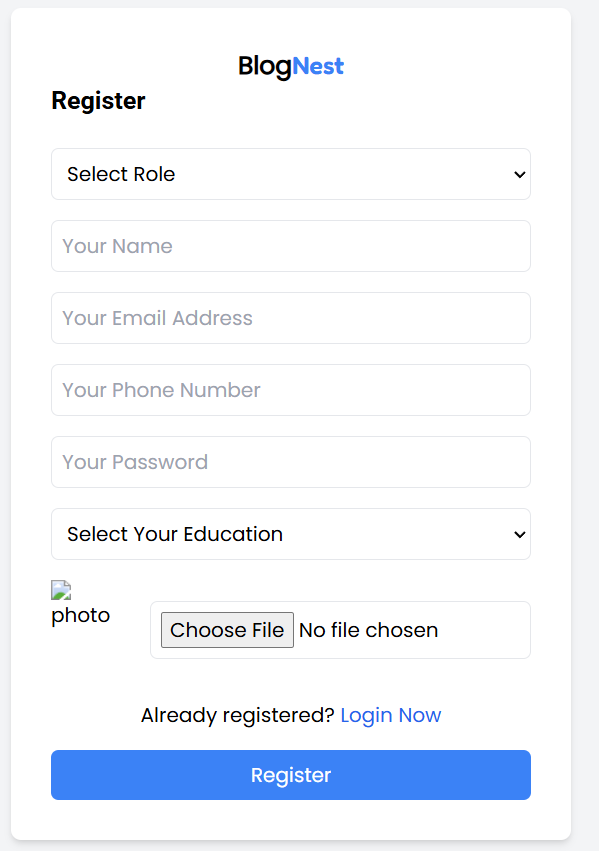
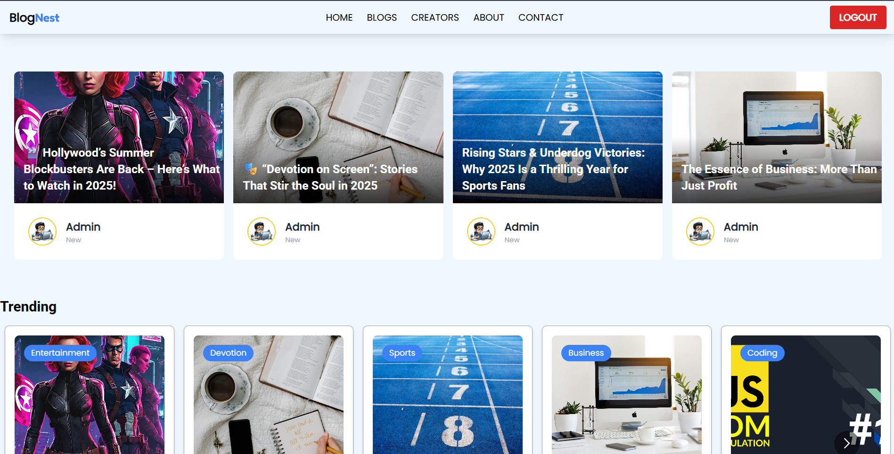
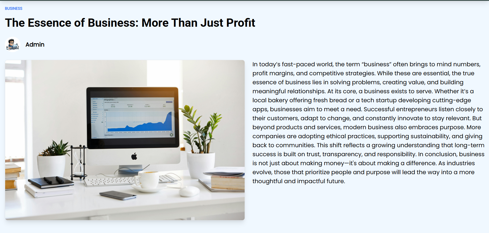
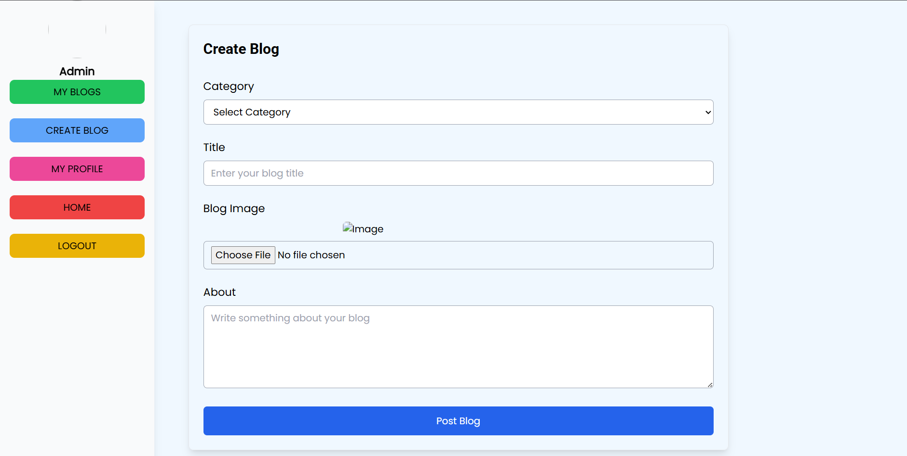

# 📝 BlogNest – Full Stack MERN Blogging Platform

BlogNest is a modern, full-stack blogging platform built using the MERN stack (MongoDB, Express.js, React.js, Node.js). It provides a seamless experience for users to read blogs and for admins to manage content efficiently with secure authentication and role-based access control.

---

## 🚀 Features

* 🔐 **Role-Based Authentication**

  * Secure Login/Signup using JWT (JSON Web Tokens)
  * Separate roles for Admin and User

* 📝 **Full CRUD Functionality**

  * Create, Read, Update, and Delete blog posts
  * Admins can manage all posts
  * Users can view posts

* 🌐 **Responsive UI**

  * Built with Tailwind CSS
  * Mobile-friendly and modern design

* ☁️ **Cloud Database**

  * MongoDB Atlas integration for scalable and reliable storage

---

## 🛠️ Tech Stack

### Frontend

* React.js
* Tailwind CSS
* Axios

### Backend

* Node.js
* Express.js
* JWT Authentication

### Database

* MongoDB Atlas

---

## 📁 Project Structure

```
BlogNest/
├── backend/           # Node/Express API, JWT Auth, Models
├── frontend/          # React + Vite, Tailwind UI
├── .github/           # GitHub Actions CI/CD workflows
└── README.md
```

---

## ⚙️ Getting Started

### Prerequisites

* Node.js (if running without Docker).
* A MongoDB Atlas Connection String.

---

## ⚙️ Installation & Setup

### 1️⃣ Clone the Repository

```bash
git clone https://github.com/Shaan-d21/BlogNest-webapp.git
cd blognest
```

---

### 2️⃣ Setup Environment Variables

Create a `.env` file inside the `backend` folder:

```env
PORT=4001
MONOG_URI=your_mongodb_url
CLOUD_NAME=cloud_name
CLOUD_API_KEY=cloud_api_key
CLOUD_SECRET_KEY=cloud_secret_key
JWT_SECRET_KEY=jwt_secret_key
FRONTEND_URL=http://localhost:5173
```

---

### 3️⃣ Run Locally (Without Docker)

#### Backend

```bash
cd backend
npm install
npm start
```

#### Frontend

```bash
cd frontend
npm install
npm run dev
```

---

Application will be available at:

* Frontend: [http://localhost:5173](http://localhost:5173)
* Backend: [http://localhost:4001](http://localhost:4001)

---

## 🔑 API Endpoints (Sample)

### Auth

* `POST /api/auth/signup`
* `POST /api/auth/login`

### Blogs

* `GET /api/posts`
* `POST /api/posts` (Admin)
* `PUT /api/posts/:id` (Admin)
* `DELETE /api/posts/:id` (Admin)

---

## 📸 Screenshots







---

## 📌 Future Enhancements

* CI/CD pipeline integration
* Rich text editor for blogs
* Comments & likes system
* Search & filter functionality
* User profile management

---

## 👨‍💻 Author

**Shaan Dewang**

---

⭐ If you like this project, don't forget to give it a star!
